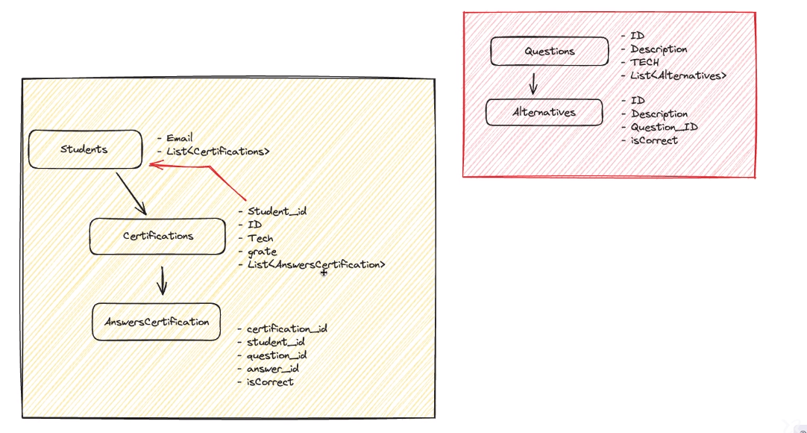

# Sistema de Cadastro e Certificação de Alunos

## Descrição
Este é um projeto desenvolvido em Java com Spring Boot, PostgreSQL como banco de dados e Docker Compose para gerenciamento de containers. O objetivo é criar um sistema de cadastro e certificação de alunos. Os alunos podem se cadastrar, realizar provas e obter certificados de conclusão.

## Funcionalidades
- Cadastro de Alunos: Os alunos podem se cadastrar no sistema fornecendo informações básicas, como nome, e-mail e senha.
- Autenticação: Os alunos podem fazer login no sistema utilizando suas credenciais.
- Provas: Os alunos podem acessar e realizar provas disponíveis no sistema.
- Certificados: Após a conclusão bem-sucedida de uma prova, os alunos recebem certificados de conclusão.

## Requisitos

- Java 21
- Spring Boot 3.2.2
- Spring Data JPA
- Maven
- Docker
- PostgreSQL
- Hibernate

## Entidades

